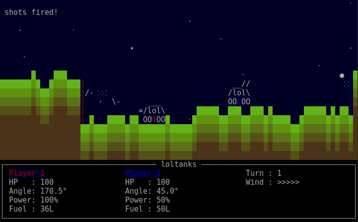

# secret portals branch of loltanks

A turn-based artillery game with a curses frontend.

### Dependencies

python3-curses

### How To Play

In a sufficiently advanced terminal emulator, run:

`python3 loltanks.py`

The controls are:

Space       : Fire

Left/Right  : Change cannon orientation

Up/Down     : Change cannon elevation

+/-         : Change projectile velocity

### What Doesn't Work

- almost everything except portals
- sometimes the portals too

### Todo

- make this work
