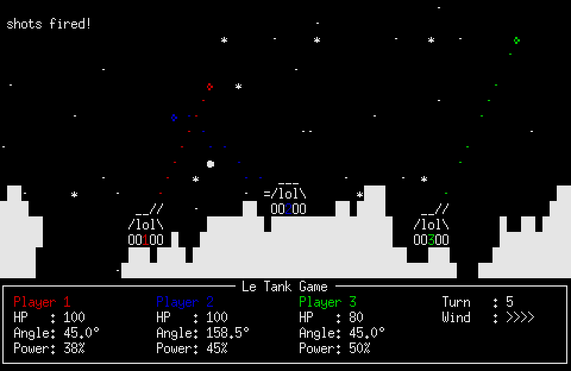

# loltanks

A turn-based artillery game with a curses frontend.

### Dependencies

python3-curses

### How To Play

In a sufficiently advanced terminal emulator, run:

`python3 loltanks.py`

The controls are:

Space       : Fire

Left/Right  : Change cannon orientation

Up/Down     : Change cannon elevation

+/-         : Change projectile velocity

### What Works

- Shooting eachother
- Dying
- Random Landscape
- Up to 4 Players
- Destructible Landscape
- Wind
- Snow (cosmetic only)

### Todo

- Moving around
- More than 1 weapon
- Prettier Landscape
- More interesting Landscape Generation
- Prettier Tanks
- A menu
- In-game-instructions
- In-game-configuration
